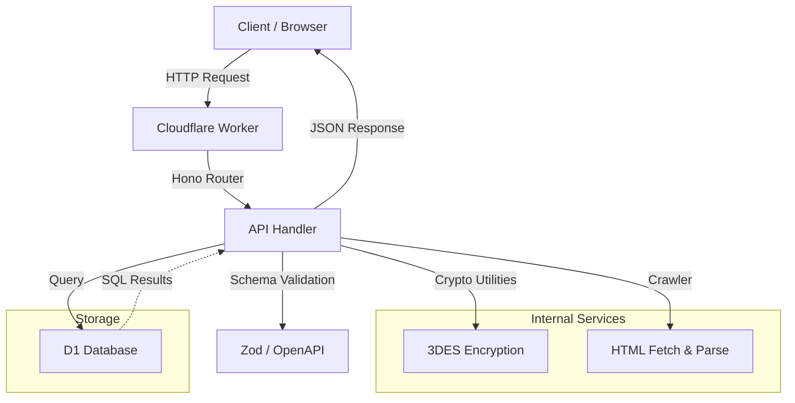

# AGENTS.md - SGKViet Codebase Guide

This document provides a high-level overview of the SGKViet project for AI agents.

## 🛠 Commands

| Action | Command |
| :--- | :--- |
| **Development** | `npm run dev` or `pnpm run dev` |
| **Deploy** | `npm run deploy` or `pnpm run deploy` |
| **Local Migrations** | `npm run db:migrate:local` or `pnpm run db:migrate:local` |
| **Remote Migrations** | `npm run db:migrate:remote` or `pnpm run db:migrate:remote` |
| **Test** | `npm run test` or `pnpm run test` |

## 🏗 Architecture & Structure

The project is a Cloudflare Workers application built with Hono and D1 Database.

### Subprojects & Key Files
- `src/index.ts`: Main entry point. Defines Hono app, Zod schemas, and API routes.
- `src/utils/crypto.ts`: Cryptography utilities (3DES) for sensitive configuration data.
- `src/utils/crawler.ts`: Utilities for fetching and parsing book data (HTML, images, total pages).
- `src/utils/string.ts`: String manipulation utilities (e.g., generating non-accented Vietnamese strings).
- `migrations/`: D1 database schema definitions.
- `wrangler.jsonc`: Cloudflare Workers configuration.

### Internal APIs (Hono + OpenAPI)
| Method | Path | Description |
| :--- | :--- | :--- |
| `GET` | `/books` | List all non-deleted books. |
| `POST` | `/books` | Create a new book. |
| `DELETE` | `/books/{id}` | Soft delete a book. |
| `GET` | `/configs` | List all non-deleted configs (decrypted). |
| `GET` | `/configs/key/{key}` | Get a single config by its key (encrypted value). |
| `POST` | `/configs` | Create a new config (encrypted). |
| `DELETE` | `/configs/{id}` | Soft delete a config. |
| `GET` | `/book_pages` | List all non-deleted book pages. Supports filtering by `book_id`, `from_page`, `to_page`. |
| `POST` | `/book_pages` | Create a new book page. |
| `DELETE` | `/book_pages/{id}` | Soft delete a book page. |
| `GET` | `/ocr_processes` | List all non-deleted OCR processes. |
| `POST` | `/ocr_processes` | Create a new OCR process result. |
| `PUT` | `/ocr_processes/{id}` | Update an OCR process record. |
| `DELETE` | `/ocr_processes/{id}` | Soft delete an OCR process record. |
| `GET` | `/ocr_fails` | List all non-deleted OCR failures. |
| `POST` | `/ocr_fails` | Create a new OCR failure record. |
| `DELETE` | `/ocr_fails/{id}` | Soft delete an OCR failure record. |
| `POST` | `/crawl` | Crawl a book URL, parse metadata, and store its pages. |
| `GET` | `/doc` | OpenAPI JSON specification. |
| `GET` | `/swagger` | Swagger UI documentation. |

### Database Schema (D1)
- **`book`**: Metadata for textbooks (title, description, URL).
- **`book_page`**: Individual pages associated with a book.
- **`ocr_process`**: Results of OCR processing (markdown, status).
- **`ocr_fail`**: Error logs for failed OCR attempts.
- **`config`**: Key-value pairs for application settings (values are 3DES encrypted).

## 🎨 Code Style & Conventions

- **Framework**: [Hono](https://hono.dev/) with `OpenAPIHono` for automatic documentation.
- **Validation**: [Zod](https://zod.dev/) for request/response schema validation and OpenAPI integration.
- **Persistence**: [D1 Database](https://developers.cloudflare.com/d1/).
- **Soft Delete**: All tables include a `deleted` boolean flag; records are rarely purged.
- **Security**: Sensitive values in the `config` table are encrypted using 3DES (`src/utils/crypto.ts`).
- **Naming**:
  - Database tables/columns: `snake_case`.
  - TypeScript variables/functions: `camelCase`.
  - Zod schemas: `PascalCase` ending in `Schema` (e.g., `BookSchema`).
- **Error Handling**: Standard HTTP status codes (200, 201) for success. Validation errors are handled automatically by `zod-openapi`.

## 🗺 Architecture Workflow

## 📝 LLM Scannability Tags
- #CloudflareWorkers #Hono #D1 #TypeScript #OpenAPI #Zod #SoftDelete #3DES
