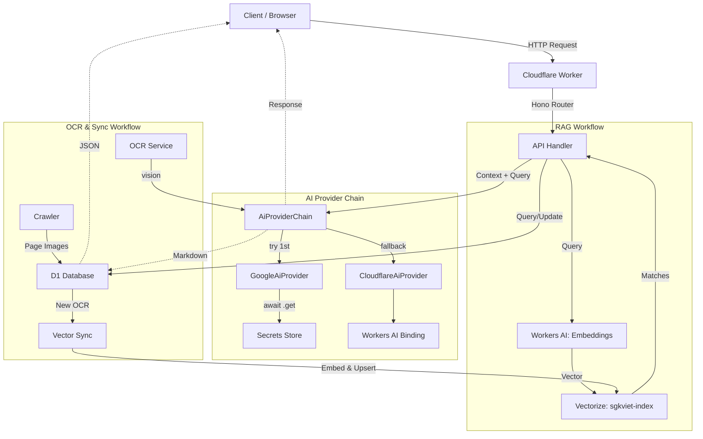

# AGENTS.md - SGKViet Codebase Guide

This document provides a high-level overview of the SGKViet project for AI agents.

## 🛠 Commands

| Action | Command |
| :--- | :--- |
| **Development** | `npm run dev` or `pnpm run dev` |
| **Deploy** | `npm run deploy` or `pnpm run deploy` |
| **Local Migrations** | `npm run db:migrate:local` or `pnpm run db:migrate:local` |
| **Remote Migrations** | `npm run db:migrate:remote` or `pnpm run db:migrate:remote` |
| **Test** | `npm run test` or `pnpm run test` |

## 🏗 Architecture & Structure

The project is a Cloudflare Workers application built with Hono, D1 Database, Workers AI, and Vectorize.

### Subprojects & Key Files
- `src/index.ts`: Main entry point. Mounts all routes.
- `src/ai/`: **AI Provider Abstraction Layer** (provider chain with automatic fallback).
  - `types.ts`: `AiProvider`, `ChatRequest`, `ChatResponse`, `VisionRequest` interfaces.
  - `google_provider.ts`: Google AI (Gemini) provider — chat + vision. API key from Secrets Store.
  - `cloudflare_provider.ts`: Cloudflare Workers AI provider — chat only, with retry logic.
  - `provider_chain.ts`: `AiProviderChain` — tries providers in order, falls back on error.
  - `index.ts`: Factory `createAiChain(env)` — wires Google (primary) → Cloudflare (fallback).
- `src/books/`: Book metadata management.
- `src/book_pages/`: Management of individual textbook pages.
- `src/ocr_processes/`: OCR results, review, and Vectorize integration.
  - `vector_service.ts`: Interaction with Cloudflare Vectorize.
- `src/chat/`: RAG-powered chat assistant (uses provider chain).
- `src/utils/`:
  - `ocr.ts`: OCR batch processing via `AiProviderChain.vision()`.
  - `embeddings.ts`: Generating text embeddings using Workers AI.
  - `vietnamese.ts`: Vietnamese linguistic review (provider chain + heuristic fallback).
  - `crawler.ts`: HTML fetching and parsing.
- `migrations/`: D1 database schema definitions.
- `wrangler.jsonc`: Cloudflare Workers configuration (Bindings: `DB`, `AI`, `VECTOR_INDEX`, `GOOGLE_AI_KEY`).

### Internal APIs (Hono + OpenAPI)
| Method | Path | Description |
| :--- | :--- | :--- |
| `GET` | `/books` | List all non-deleted books. |
| `POST` | `/books` | Create a new book. |
| `POST` | `/chat` | RAG-powered chat with textbook content. |
| `GET` | `/book_pages` | List book pages with filtering. |
| `GET` | `/ocr_processes` | List all OCR results. |
| `POST` | `/ocr_processes/upsert` | Upsert OCR result and sync to Vectorize. |
| `POST` | `/ocr_processes/reindex` | Reindex range of OCR results into Vectorize. |
| `GET` | `/ocr_processes/vectors` | List vectors from Vectorize index. |
| `POST` | `/crawl` | Crawl book metadata and pages. |
| `GET` | `/doc` | OpenAPI JSON specification. |
| `GET` | `/swagger` | Swagger UI documentation. |
| `GET` | `/health` | Health check for providers and bindings. |

### Database Schema (D1)
- **`book`**: Metadata for textbooks (title, description, URL).
- **`book_page`**: Individual pages with image URLs.
- **`ocr_process`**: OCR markdown, status, and linguistic review.
- **`ocr_fail`**: Error logs for failed OCR attempts.
- **`config`**: App settings (e.g., AI model overrides).
- **`chat_log`**: History of chat interactions (role, content, session).

## 🎨 Code Style & Conventions

- **Framework**: Hono with `@hono/zod-openapi` for type-safe routing and documentation.
- **Validation**: Zod for schemas.
- **Persistence**: D1 (SQL) for structured data, Vectorize for semantic search.
- **AI**: Unified `AiProviderChain` with automatic fallback. Google AI (Gemini, primary) for OCR/chat/review via Secrets Store API key. Cloudflare Workers AI (fallback) for chat. Workers AI for embeddings (`@cf/baai/bge-base-en-v1.5`).
- **Secrets**: Google AI API key stored in Cloudflare Secrets Store (`sgkviet-gateway_google-ai-studio_gemini`), accessed via `env.GOOGLE_AI_KEY.get()`.
- **Naming**: `snake_case` in DB, `camelCase` in TS, `PascalCaseSchema` for Zod.

## 🗺 Architecture Workflow

## 📝 LLM Scannability Tags
- #CloudflareWorkers #Hono #D1 #Vectorize #RAG #WorkersAI #TypeScript #OpenAPI #Zod #SoftDelete #Gemini #GoogleAI #SecretsStore #ProviderChain
